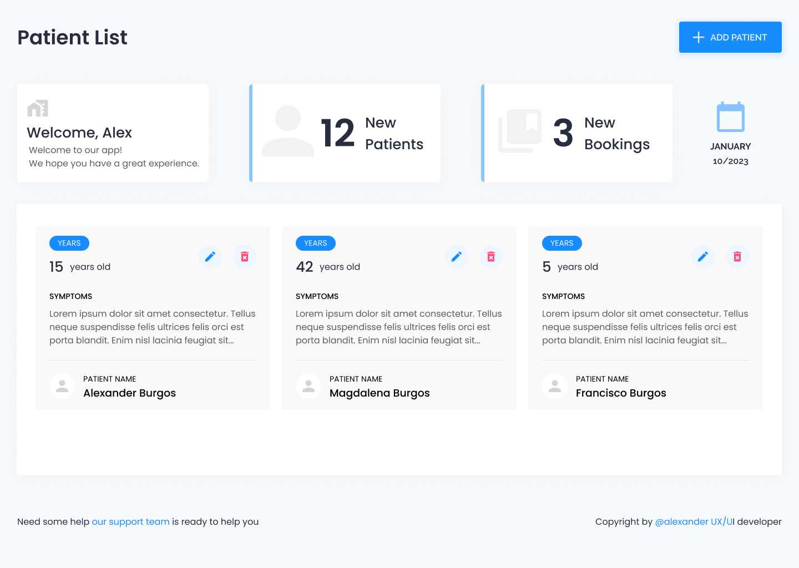

<h3>Patient Registration List</h3

This project was developed using React, a popular JavaScript library for building user interfaces. It allows users to create, edit, and delete patient records in a simple and intuitive way. The project utilizes functional components and hooks to manage state and handle user interactions.

The user interface is clean and easy to navigate, making it simple for users to add new patients, edit existing records, or delete patients from the list. The application also includes validation to ensure that all required fields are filled out before a new patient is added to the list.

The project is fully responsive and can be accessed from any device, making it easy to manage patient records on the go. The code is well-organized and easy to understand, making it a great learning resource for those who are new to React.

In addition, this project is open-source and available on GitHub. You can find the code, documentation, and installation instructions on the repository. Feel free to clone, download or fork the project to use it as a starting point for your own project or to contribute to the project.

